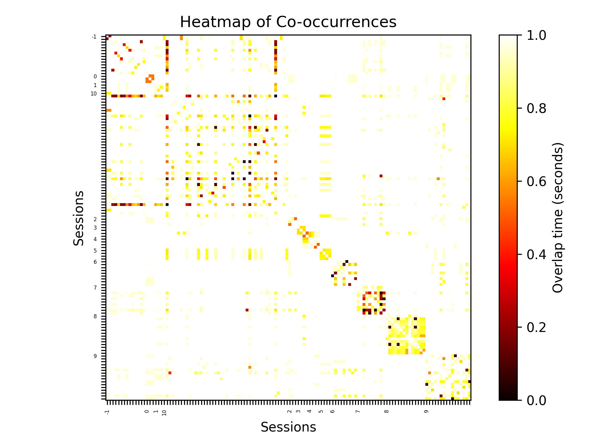
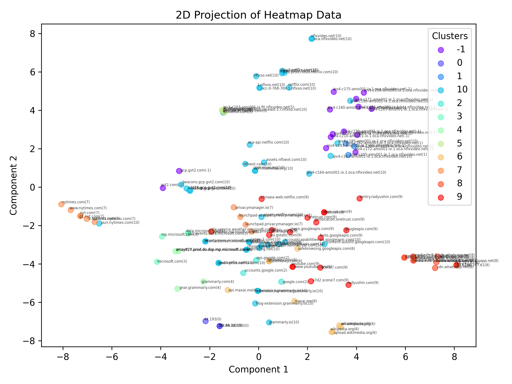

# inspect

Clustering web traffic data to extract used applications and third-party services.
## General Overview

The main purpose of this module is to cluster the web traffic of a user. Additionally, some supporting features are provided for:
- parsing `pcap` files for test data;
- analysis and visualization tools in `python`;
- framework for test sessions and expected clusters from them.

Four data structures are important to understand how this module operates:
1. `TransportRecord` (found in `payload` package) - this is the expected input data which represents the web traffic of a user.
2. `CoOccurrence` (found in `grouping` package) - this is the data that the clustering uses. It is constructed by parsing the transport records and storing the results in a [cooccurrence matrix.](#cooccurrence-matrix).
4. `ClusterOpts` (found in `grouping` package) - this is the options that are passed to the clustering, including where to find the data (as currently we load it) and if we want to visualize the results.
5. `OverlapFunctions` (found in `grouping` package) - this defines what function to use when calculating how similar two sessions are (a session is all the packets of a TCP/TLS connection). Check [this section](#overlap-functions) for further explanation on available options for overlap functions.

Currently, as this module is still exploratory the steps of the process are split and provided into different modes. Thus, each step saves its results in a file that is then loaded by the next to ensure that each step works correctly in isolation from the rest. 

To run the module use `go run . MODE` where `MODE` is one of the following:
- `p` (create transport records from a `pcap` file)
- `dt` (displaying transport data)
- `t` (build cooccurrence matrix from transport data)
- `c` (cluster cooccurrence matrix)
- `e` (evaluate a clustering)
- `ghc` (run a genetic hill algorithm that tries to optimize clustering parameters)
- `st` (save the times of transport records)
- `rc` (test version of reducing cooccurrence matrix)

## Modes

To ease the use of this module we added a `TestSession` struct (found in `evaluation` package) which consists of all the file paths relating to a single input data stream. Currently, we have two test sessions - `TestSession1` and `TestSession2` where only the former's data is available. To use the later, simply store a `pcap` file in `data/ts2` called `ts2.pcapng`. Then, you can use the different modes to run through the data parsing, clustering and evaluating process. Check the [Example](#example) section for a step-by-step guide.

###  `p`
This mode parses a `pcap` file and saves the packets as different transport record types, i.e., open, incoming, outgoing, close packets. Then, the packets are grouped depending on the TCP session they are a part of. Thus, we get as a final result that each TCP/TLS session is represented as a `TransportRecord` which contains all the packets of that session. The results are stored in a file.

Was this module to be integrated into `connect`, this functionality would be redundant as `connect` would be responsible for giving the packets in the defined `protobuf` objects to `inspect`. For now, this functionality is used to use test data and parse it in the expected format.

### `dt`
This mode is used for debugging purposes to print the transport records of a test session.

### `t`
This mode parses a list of transport records from a file and builds the corresponding [cooccurrence matrix.](#cooccurrence-matrix) Here, [`OverlapFunctions`](#overlap-functions) are used to define how the correlation between two sessions is calculated. The functions used are defined in the the `main.go` program and can be changed from there. The resulting cooccurrence matrix is saved in a file. Additionally, the total size of the sparse matrix and some statistics about the overlap values are given.

### `c`
This mode loads a cooccurrence matrix from a file and runs a clustering. Currently, to cluster we use an HDBSCAN implementation in `go` which has only one parameter which is quite intuitive to choose. Before we used `ClusterOpts` to define the `ClusterMethod` as we were using a `python` implementation which has many clustering methods with different hyper parameters that can be adjusted. We have kept this infrastructure of having a `ClusterMethod` (that can be either HDBSCAN or OPTICS), even though, it is not used for this mode, in case it is needed in the future.

The resulting clustering is printed together with the likelihood of each session being in that cluster (which are not useful in the moments because the `go` clustering method does not provide them). Additionally, the results of the clustering are visualized using a supporting script `data_insights.py` that saves a heatmap of the clustering as well as a 2D projection found in `images/data_insights/heatmap.png`  and `images/data_insights/projected.png`, respectively.

Technically, you can still revert to the old `python` clustering by changing the `grouping.Cluster` method to call `PythonCluster` in stead of `GoCluster`. This will make the printed probabilities meaningful and the `ClusterMethod` relevant.

### `e`
This mode evaluates a clustering. It uses the `TestSession` struct in full. It also represents a more full workflow of the project.  It first, builds a cooccurrence matrix using the [`OverlapFunctions`](#overlap-functions) defined in `main.go`. Then, it clusters (similar to the previous mode). Finally, it evaluates the clustering based on defined `regions`. These are manually defined sets of start and end times (in relative seconds from beginning) of when a website was visited during the recording of a test session. The `regions` are passed through a `RegionsFunc` in the `TestSession` struct where the different region functions are defined in the `evaluation` package.

The output is similar to the `c` mode. Additionally, the evaluation of the clustering is provided based on several metrics (size, average clustered purity, unclustered purity) which can be found in the `evaluation` package.

### `ghc`
This mode runs a genetic (hill climbing) algorithm in order to try and find the best hyper parameter values for the used clustering algorithm. It uses the old `python` clustering. To change the used `ClusterMethod` check the `GeneticHillClimbing` method in the `evaluation` package for variable `clusterMethod`. Here the graphs are not saved and the cooccurrence maps that are built along the way are saved in `data/ghc/` to be reused.

### `st`
This mode parses the transport records and saves only the timestamps of each packet. The produced file conforms `protobuf` objects and can be used in python to visualize the times using the `times.py` script in the `analysis` folder. This command is useful to visualize the packet flow during a test session.

### `rc`
This mode is a test implementation showing how [count–min sketch](https://en.wikipedia.org/wiki/Count%E2%80%93min_sketch) could be used to reduce the size of the cooccurrence matrix. As currently it is a sparse matrix we often cannot know how big it will be before we start parsing the transport records. However, with count-min sketch we can build a fixed size matrix that is probabilistic in nature with several guarantees on how close the values we get are to the real ones (this data structure can only overestimate values). 

The mode, currently, loads a cooccurrence matrix and then runs count-min sketch on it. The sizes of both the original sparse matrix and the reduced one are printed. The parameters for count-min sketch can be changed from the code. Additionally, the results from it can be saved (some code needs to be uncommented) so that a clustering can be run on the resulting reduced matrix.

**Note**, *this mode has been made only to experiment with count-min sketch and see if it is a viable option for reducing the matrix.*

## Testing

Besides the `TestSession` struct there is a `clustering_test.go` file which defines test cases for clustering. The test cases are predefined lists of domain names that are expected to be clustered together from a test session (these should be quite clearly related). The `st` mode and `times.py` script are a useful tool when deciding which domain names need to be clustered together when defining a test case since they allow to extract the times of a test session and visualize them to find clearly related domain names.

## Cooccurrence Matrix

The cooccurrence data is stored in a sparse 2D matrix where the indices represent sessions which, as already mentioned, are the different connections/website traffic in the input data. To save space the indices of the matrix are `uint64` and an internal mapping is used that translates from a domain (website) name (`string`) to an index (called a `SessionID`) in the cooccurrence matrix. The matrix is constructed by using the timestamps of a transport record (representing a session) and calculating the total overlap between each pair of sessions using an [overlap function](#overlap-functions).
## Overlap Functions

There are two options for an overlap function to use. First, `FixedMarginOverlap` with a parameter `Margin` (in nanoseconds). This function calculates overlap between sessions by using each timestamp of a transport record and translating it into a region of time with length of `2*Margin`. Below is an example of how this overlap function works for a margin of 30:


The second type of overlap function is `GaussianOverlap` which uses a normal distribution around each timestamp to calculate overlap. It has two parameters - `StdDev` which is the standard deviation in nanoseconds and `Cutoff` which is a hard cutoff in number of standard deviations. It is suggested to use cutoff of 4 standard deviations as that contains 99.99% of the distribution. Below is an example of gaussian overlap using standard deviation of 30 and cutoff at 4:


## Example

This section goes over an example of how to use most of the functionalities in the module. We will show how we made `TestSession1` and how we use it.

First, we record a WireGuard session where we go through a bunch of websites in a browser and note when we open a website and when we exit it (relative time in seconds since beginning). The times can be seen in the below table:
| Website   | Opened | Closed |
| --------- | ------ | ------ |
| Wikipedia | 11     | 69     |
| CAT.com   | 78     | 136    |
| Netflix   | 136    | 185    |
| NY Times  | 194    | 250    |

We save the recorded traffic in a file called `ts1.pcapng` (which can be found under `data/ts1`). Then, we define the `TestSession1` variable in `evaluation/test_session.go` as follows:
```go
var TestSession1 = TestSession{
	SourceIP:         "145.94.160.91",
	DataPath:         "data/ts1/ts1.pcapng",
	SavePath:         "data/ts1/ts1_transports.pb",
	CoOccurrencePath: "data/ts1/ts1_cooccurrence.pb",
	TimesPath:        "data/ts1/ts1_times.pb",
	Regions: []region{
		{minT: 11, maxT: 69},
		{minT: 78, maxT: 136},
		{minT: 136, maxT: 185},
		{minT: 194, maxT: 250},
	},
}
```
Here, we need to add the path to the `pcap` file as the `DataPath`, the start/end times as `Regions` and the source IP of the machine we were on (to know which direction is incoming and which is outgoing) as `SourceIP`. The other path names we choose as we like.

First, we need to parse the `pcap` file in transport record so we use mode `p`: 
1. `go run . p`

We see that 84 thousand packets TCP packets were saved as transport records in `data/ts1/ts1_transports.pb`.  We can check these in cleartext using the mode `dt`.

Now, let's try to visualize the times of the records. It should be noted that **all `python` scripts should be run from the `analysis` folder**. We run the program in `st` mode to save the times in `data/ts1/ts1_times.pb` and then use the `times.py` script to save the visualization in `images/times.png`:

2. `go run . st`
3. `python3 times.py filename=../data/ts1/ts1_times.pb` from `analysis` folder

The resulting image looks as follows:


Good, now we have an idea of what the timestamps look like. Let's move onto clustering. 

Next, to build the cooccurrence matrix, we have to decide what [overlap function](#overlap-functions) to use. We go for the one already available in `main.go` (so we don't change anything in the source code) which is a fixed margin of 10 milliseconds:
```go
overlapFunctions := grouping.FixedMarginOverlap{
	Margin: grouping.TimestampInNano(0.010000000), // x seconds fixed margin
}
```
Next, we run the program in mode `t`:

1. `go run . t`

This saves the resulting cooccurrence matrix in `inspect/data/ts1/ts1_cooccurrence.pb` and shows some stats like that the data is 18Kb with 128 session IDs and in total 857 values in the matrix.

Now, let's cluster the data. To do so we run mode `c`:

5. `go run . c`

We get the resulting clustering printed in the terminal as well as two graphs. The first (`inspect/images/data_insights/heatmap.png`) is a heatmap which orders the session IDs per cluster and displays the cooccurrence matrix so that we can see how close the overlap values are in clusters. The heatmap is shown below where the axis are labeled at the start of each cluster:



The second graph is a projected view of the sessions with their names and colored based on which cluster they are in. This is just a supporting tool to visualize the clustering (the projection uses `TSNE` from `sklearn` as an arbitrary projection technique):



Finally, in stead of clustering we can also cluster and evaluate (mode `e`):

1. `go run . e`

The results are the same as in the clustering but we get an additional evaluation of the clustering based on the `Regions` provided in the `TestSession` struct. We also get how long each step of the process (cooccurrence, cluster, evaluate) took.

This concludes our example. We did not look at the `ghc` and `rc` modes as they are not related to the main workflow of the module.